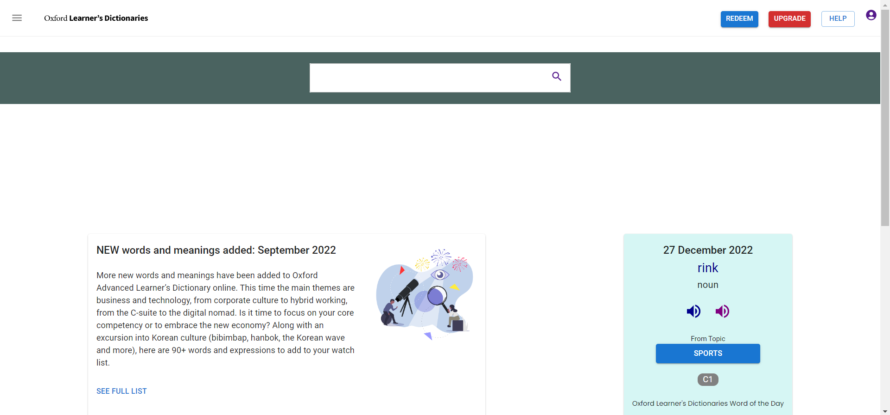
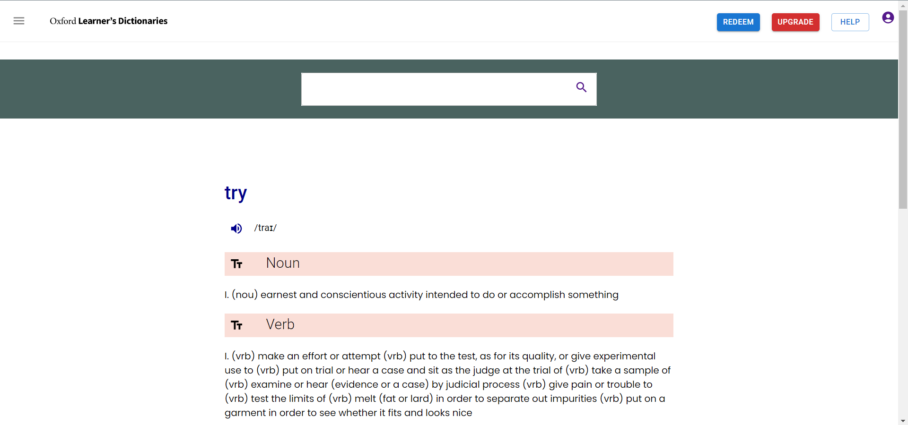
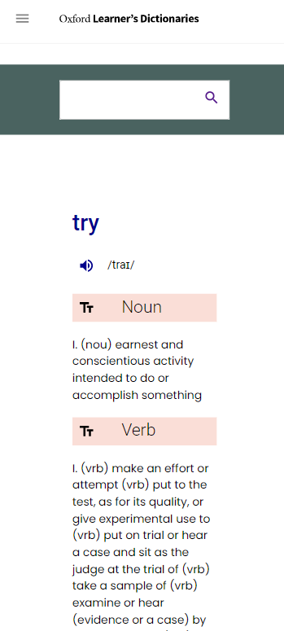
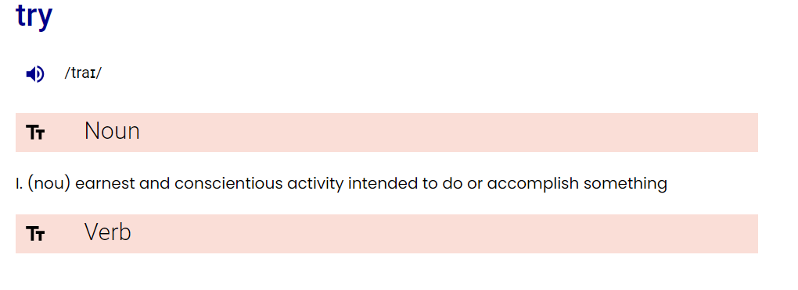
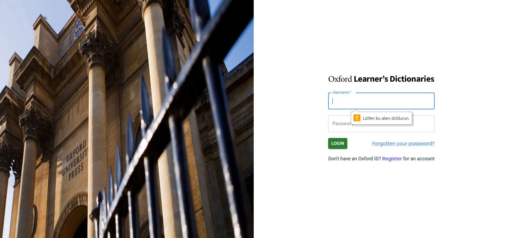
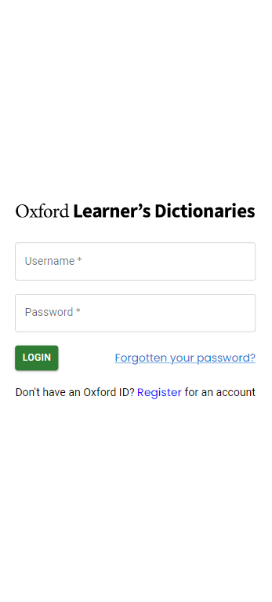

# Oxford Dictionary Clone Project
<h1>Explanation</h1>

This repo is a clone project of "oxfordlearnersdictionaries.com". I used React, React-Router-Dom, Material UI, Axios, Formik and Yup in this project. This project created with "create-react-app" package. All pages and components have responsive design.

<h1>Main Page</h1>

I used React, React-Router-Dom, Material UI and pure CSS for frontend design and page order. Pages have responsive design and Flexbox struct. If page width low than 720px, flex direction property changes from row to column.

Searchbar sends input value to api. I used Axios library for data fetching and I choose Twinword Word Graph Dictionary api.

<h1>Definition Page</h1>

Api response data is listing this page. Words have 4 meanings and their related pieces is closable struct with buttons.

<h1>Login Page</h1>

Login page has two input area(Username and password). I used Formik and Yup for form validation.

